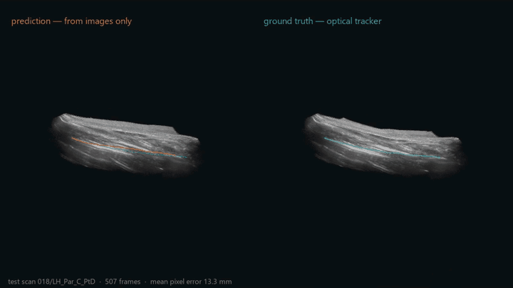
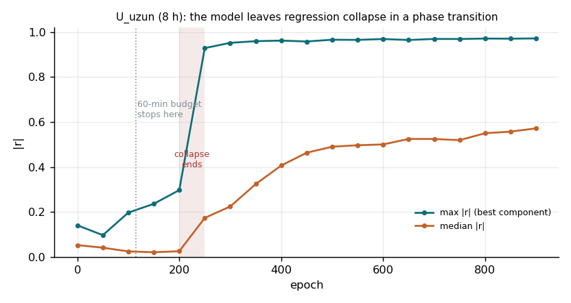
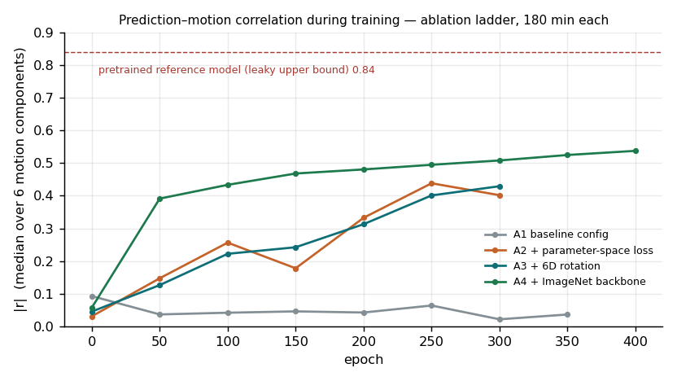
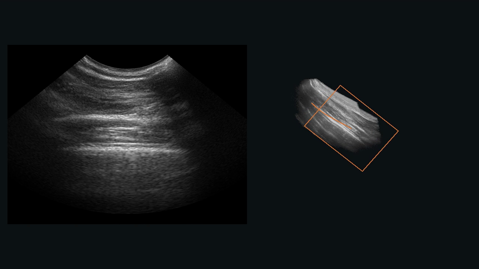

# SerbestEl — Sensorless Freehand 3D Ultrasound Reconstruction

> Türkçe sürüm: [README.tr.md](README.tr.md)

Reconstructing a 3D volume from a hand-held 2D ultrasound sweep **without any
position sensor**. A network looks at consecutive frames, predicts the rigid
motion between them, and the motions are chained to place every frame relative
to the first one.

The benchmark is **TUS-REC** (MICCAI 2024/2025 challenge, UCL). The challenge
has closed; this project works against its published results and its public
baseline, it is not a leaderboard entry.



*Median test scan (not a hand-picked one): left, volume built from the
model's image-only pose estimates; right, the same frames placed with the
optical tracker. The gap between the orange and teal probe paths is the
accumulated drift.*

---

## Results at a glance

**Drift error (GP) reduced by 83% relative to the reference system**:
86.90 mm → 14.40 mm on an untouched test set (10 subjects, 240 scans). All four
metrics beat the challenge's own baseline. Trained on a single 4 GB laptop GPU
in eight hours.

| Model | GP | GL | LP | LL | GP/LP |
|---|---|---|---|---|---|
| Reference baseline, reproduced from scratch | 86.90 | 83.65 | 0.3856 | 0.3850 | 225× |
| `U_uzun` (6D rotation + ImageNet backbone, 8 h) | 17.25 | 16.35 | 0.1565 | 0.1372 | 110× |
| **`U_uzun_C` (+ parameter-space loss, 8 h)** | **14.40** | **12.52** | **0.1510** | **0.1313** | **95×** |
| `U_uzun_C`, second seed | 15.27 | 13.76 | 0.1548 | 0.1353 | 99× |
| *`U_uzun_C`, mean of 2 seeds* | *14.84 ± 0.43* | *13.14 ± 0.62* | *0.1529* | *0.1333* | |

All values in mm, test set, full 307,200-pixel grid. **GP/GL** are errors
relative to the first frame (they accumulate — this is the drift); **LP/LL**
are frame-to-frame errors. See [Metrics](#metrics).

### Cumulative ablation — what each idea contributed

Each row adds one change on top of the previous one; all rows trained for the
same 180 minutes, validation set:

| Row | Adds | GP | LP | \|r\| | GP vs. previous row |
|---|---|---|---|---|---|
| `A1_referans` | baseline configuration | 93.18 | 0.4007 | 0.031 | (anchor) |
| `A2_C` | loss in parameter space | 28.93 | 0.2106 | 0.371 | **−69.0%** |
| `A3_CB` | + 6D continuous rotation | 21.98 | 0.1953 | 0.366 | −24.0% |
| `A4_CBG` | + ImageNet-initialised backbone | **20.91** | **0.1888** | **0.522** | −4.9% |

`|r|` is the correlation between predicted and true motion, median over the
six motion components. Near zero means the model is not looking at the image —
it outputs the dataset's average motion (*regression collapse*). The central
finding of the project lives in this column: the reference configuration stays
collapsed even with three times the budget (0.031 after 360 epochs). **What
gets the model out of collapse is configuration, not training time**; the
budget only lets the escape become visible.

### Position against published results

TUS-REC2024 official leaderboard (the challenge's *hidden* test set):

| Rank | Team | GPE | GLE | LPE | LLE |
|---|---|---|---|---|---|
| 1 | ImFusion | 9.25 | 6.99 | 0.153 | 0.120 |
| 2 | MUSIC Lab | 9.85 | 8.12 | 0.138 | 0.116 |
| 3 | COCHE | 13.89 | 10.71 | 0.172 | 0.143 |
| 4 | AGH-MedApp | 18.61 | 15.96 | 0.179 | 0.153 |
| 5 | AMI-Lab | 21.80 | 19.65 | 0.177 | 0.157 |
| 6 | QBME | 25.71 | 21.73 | 0.216 | 0.183 |
| 7 | *Challenge baseline* | 26.11 | 23.68 | 0.214 | 0.181 |
| — | **This work (`U_uzun_C`)** | **14.40** | **12.52** | **0.151** | **0.131** |

**This is not a ranking — the test sets differ.** The leaderboard was scored
on the hidden test cohort; our numbers come from our own subject-level split of
the public training data. Same protocol and device, different subjects. Read
as an indication only:

- **Local accuracy is competitive with the top.** LP 0.151 is ahead of 3rd–7th
  and of 1st place (0.153), behind only 2nd (0.138); LL is behind the top two.
- **Global accuracy sits between 3rd and 4th place**, closer to 3rd.
- **The challenge baseline is beaten on all four metrics** — that baseline was
  trained for 20,000 epochs; ours ran 866 epochs on a 4 GB laptop GPU.

Sources: [TUS-REC2024 leaderboard](https://github.com/UCL/tus-rec-challenge/blob/main/leaderboard.md),
[challenge report (arXiv:2506.21765)](https://arxiv.org/abs/2506.21765).

---

## Key findings

The project ran in seven phases (setup → data → baseline → diagnosis →
improvement → ablation → packaging). Every experiment, including the ones that
failed, is logged. The findings below are the ones that changed what we did
next.

### 1. The reproduced baseline was in regression collapse

Fitting `prediction ≈ a·truth + b` per motion component on 240 test scans gave
`|r| ≤ 0.023` for all six components: the network produced an almost constant
transform regardless of the input. Evidence from four independent angles:

- **No correlation.** The same measurement code on the (leaky) pretrained
  reference model gives r = 0.84 / 0.53 / 0.77 for translation — so the
  measurement can see correlation when it exists.
- **Drift grows linearly, not as √N.** Linear-fit residual 0.00063 vs. 0.02843
  for square-root: unbiased noise would grow as √N, linear growth is the
  signature of **bias**.
- **Per-scan bias explains 83% of the drift.** Removing each scan's own mean
  error ("oracle") drops GP from 86.9 to 14.4 mm and improves 240/240 scans. A
  single global correction learned on other subjects *hurts* (+1%): the bias is
  **scan-specific**, and the pretrained model shows the same structure (−53%
  oracle, +2% global). It is a property of the method, not of our model.
- **Visually**: on the worst scans the true path curls over 210 mm while the
  prediction is a short straight line — exactly what chaining a constant
  transform produces.

### 2. Collapse ends in a phase transition, not gradually

Five independent changes (backbone init, rotation representation, temporal
context, loss space, data density) each moved GP by 2–6% under a 60-minute
budget and **none of them moved |r|**. The remaining axis was training scale,
so the winning configuration was trained eight times longer with a snapshot
every 50 epochs:



The model sits at |r| ≈ 0 for 200 epochs and then leaves collapse abruptly
between epochs 200 and 250 (best-component |r| 0.30 → 0.93). The 60-minute
budget stopped at epoch ~115 — halfway to the exit. Every 60-minute experiment
had been measuring the depth of the collapse basin, not the contribution of an
idea; that is why five axes gave the same small gain and their gains did not
add up (6.2% + 5.7% → 7.6%, not 11.9%).

### 3. It is configuration, not budget

The first row of the ablation ladder (`A1_referans`, baseline configuration)
ran 360 epochs — far past the epoch 200–250 transition — and stayed collapsed
(|r| 0.031). The coherence curves of the ladder make this visible:



- **A1 is flat** at 0.02–0.06 for 350 epochs. More training does not help the
  baseline configuration.
- **Parameter-space loss (A2) starts the escape**; 6D rotation (A3) barely
  changes the curve but improves final GP by a further 24%.
- **ImageNet initialisation (A4) moves the escape forward**: |r| 0.39 at epoch
  50, a level A2 reaches only around epoch 200–250. Its GP contribution at
  the end point is the smallest (4.9%) — its contribution is **speed**.

### 4. An ablation number belongs to the budget it was measured at

The same change — point-based loss → parameter-space loss — measured three
times:

| Budget and base | GP change (validation) | What was being compared |
|---|---|---|
| 60 min, baseline | −37.8% | both runs inside the collapse basin |
| 180 min, baseline configuration | **−69.0%** | one escaped, one did not |
| 480 min, on top of 6D + ImageNet | −6.2% (test: −16.5%) | both escaped; end points compared |

Frame-level validation error explains it: at epoch 230 the parameter-loss run
is at 0.229 mm vs. 0.305 mm, at epoch 460 it is 0.203 vs. 0.208. The loss
makes the model **escape earlier**; once both have escaped the gap closes.
The remaining gain is not local (LP unchanged) but global (GP/LP 89× → 84×):
the parameter loss produces less *biased* predictions. A short budget can hide
an idea's contribution (finding 2) or inflate it (this one).

### Why the parameter-space loss wins

The roadmap suggested a point-based loss; the reference loss already *is*
point-based (the predicted transform is applied to the image corners and the
error is in mm), so the parameter-space run was planned as a **negative
control**. It won instead. A loss in millimetres is dominated by translation,
where the magnitudes are; a loss on the raw six parameters weighs rotation more
evenly — and the diagnosis had measured that rotation is learned markedly
worse than translation (pretrained-model slope 0.09–0.29 for rotation vs.
0.30–0.73 for translation).

---

## What did not work — and why

Negative results are results. Each was measured, not assumed.

| Idea | Result | Reason |
|---|---|---|
| **LR on plateau** (`L_plato`) | Identical to baseline to the decimal | The LR never dropped: validation kept improving slightly and the patience never ran out. There was no plateau to act on. Side benefit: proved runs are deterministic |
| **Forward–backward consistency** (`D_tutarlilik`) | Worst row, GP +33.9% | Judges the implementation, not the idea: only 13 epochs in 60 min (baseline 108). Expected cost ~2×, measured ~8×. The constraint's maths is verified in `tests/test_temsil.py` T6 — it was never tested fairly |
| **Longer temporal context** (`A_baglam`, 5 frames) | Best local accuracy (LP 0.3988), smallest global gain (2.4%) | GP/LP got *worse* (230× vs. 227×): better per-frame estimates, not less drift. Drift is set by the bias, not the size, of the error |
| **Global drift correction** | Hurts both models (+1%, +2%) | The bias is real and large but scan-specific; no single constant removes it |
| **Data densification** (`S_ezber`, diagnostic) | |r| still 0.066 | 24 scans, 2400 epochs. The GP drop (94 → 75) came from a narrower bias, not learning — local accuracy got worse (0.413 → 0.496) |
| **5-frame context on the best model** (`U_uzun_CA`, 8 h) | GP 26.35 vs. 14.43, LP 0.196 vs. 0.173 (validation) | Worse on every metric, drift ratio 134× vs. 84×. Not a budget artefact this time: 1122 epochs, past the phase transition, \|r\| 0.51. Untested hypothesis: with 10 frame pairs in the loss, the parameter loss is dominated by the wider-spaced pairs, while the evaluation chains only adjacent ones |
| **5-frame context, adjacent pairs only** (`U_uzun_CA1`, 8 h) | GP 16.07 vs. 14.43, LP 0.1732 vs. 0.1726 (validation) | Tests the hypothesis above with one change (`--tek-aralik 1`: 4 adjacent pairs instead of 10 mixed ones). Hypothesis confirmed — GP 26.35 → 16.07 (−39%) — but five frames still do not beat two: drift ratio 93× vs. 84×, local accuracy unchanged. **Re-measured on all 240 validation scans: GP 16.31 vs. 16.87 (mean of two `U_uzun_C` seeds) — a tie** (paired difference −0.56 ± 0.49 mm, better on 52% of scans). The 60-scan ranking had called it a loss; five frames neither help nor hurt |

## Known limitations

- **Not a ranking.** The test set is our own subject-level split of the public
  data, not the challenge's hidden test set.
- **Two seeds for the best model, one for everything else.** `U_uzun_C` was
  re-run with a second seed: test GP 14.40 vs. 15.27 (mean 14.84 ± 0.43,
  −82.9% vs. the reference), so the headline holds and both seeds beat
  `U_uzun` (17.25). The same pair differs by **31% on validation** (14.43 vs.
  18.84) but only 6% on test: the 60-scan validation set is too small to rank
  close configurations. Re-measured on all 240 validation scans the seed gap
  is 4% (16.52 vs. 17.22), and `U_uzun_CA1`'s apparent 11% loss becomes a tie.
  Ladder rows and Faz 4 rows were ranked on 60 scans: their large steps (69%,
  24%) stand, small ones (the last ladder step, 4.9%) are inconclusive.
- **Drift is not solved.** GP/LP fell from 225× to 95× but remains large; the
  remaining error is a scan-specific bias. A single constant correction was
  shown to fail; a scan-adaptive method was not tried.
- **Short scans only.** TUS-REC2025 training data access is still pending; the
  model was trained and tested on TUS-REC2024 (median 547 frames per scan) and
  not measured on the 1570-frame rotating scans of 2025.
- **Budget is ~4% of the reference.** 866 epochs vs. 20,000; the ladder is
  limited to 180 minutes per row.
- **Consistency constraint not tested fairly** (see above).
- **One anatomy, one device.** Forearm scans, one probe, one protocol.
  Generalisation was not measured.
- **No real-time claim.** System-level inference speed was not measured;
  reconstruction is offline.

---

## Method

**Baseline.** The TUS-REC baseline (included as a pinned git submodule):
EfficientNet-B1 takes two consecutive 480×640 frames as channels, predicts the
rigid transform between them as six parameters (Euler angles + translation),
and is trained with a point-based loss in millimetres. Transforms are chained
to obtain each frame's pose relative to the first frame.

**What changed** (each change is one flag, see `scripts/faz4_deney.py`):

| Flag | Change |
|---|---|
| `--donme-temsili 6b` | 6D continuous rotation representation (Zhou et al.) instead of Euler angles. The final layer's bias is initialised so that every representation starts from the identity transform — without this, 6D starts at 131 mm error instead of 15 mm and the comparison is meaningless |
| `--omurga-onegitimli` | Backbone initialised from ImageNet (first conv adapted to 2 channels). ImageNet contains no ultrasound, no subjects and no motion labels, so it carries no leakage |
| `--kayip-uzayi parametre` | Loss on the raw transform parameters instead of on transformed points in mm |
| `--sure-siniri` | Budget fixed in **wall-clock minutes**, not epochs, so ideas with different per-epoch cost are compared fairly |

**Why training starts from scratch.** The reference training script loads
TUS-REC2024 pretrained weights, which were trained on **all 50 subjects** —
including any we would hold out. A subject-level split does not fix this;
the scores would be inflated with no error message. All our models train with
`--on-egitimli yok` (no pretrained task weights); the pretrained model is used
only as a labelled, leaky upper bound.

**Own training loop.** The reference `train.py` does not run on Windows (no
`__main__` guard with `num_workers=8` under `spawn`). `src/egit.py` imports the
network, loss, label transforms and data loader **directly from the reference**
— the maths is untouched — and adds the guard, AMP, gradient accumulation
(2×8 = the reference batch of 16 in 4 GB), subject-level splits and resumable
checkpoints.

**Measurement without building DDFs.** The reference evaluation builds four
displacement fields in memory (~11.6 GB). Since
`DDF_true − DDF_pred = T_true·p − T_pred·p`, the point's own position cancels
and the error can be computed block-wise without the fields (~88 MB).
`tests/test_olcum.py` verifies the four numbers match the reference to a
relative difference of 4·10⁻⁷.

## Metrics

Four displacement errors (mm), always reported together:

| | What | Why |
|---|---|---|
| `GP` | all pixels, relative to the first frame | captures drift |
| `GL` | landmarks, relative to the first frame | clinical point accuracy, global |
| `LP` | all pixels, relative to the previous frame | step-by-step motion |
| `LL` | landmarks, relative to the previous frame | clinical point accuracy, local |

A single number is misleading: being good locally and bad globally is the
classic trap of this problem. **GP/LP** is the drift ratio — how much the
per-frame error is amplified by chaining.

## Data

| Set | Access | Size | Notes |
|---|---|---|---|
| TUS-REC2024 training (parts 1–2) | public | 83.8 GB zipped → 186 GB | 50 subjects (000–049), 1200 scans, 606,597 frames |
| TUS-REC2025 validation | public | 1.23 GB | 3 subjects (050–052), 6 rotating scans, 1570 frames each |
| TUS-REC2025 training | restricted, request pending | ~22 GB | |

Data licence: CC-BY-NC-SA-4.0. **No data is included in this repository.**
Subject IDs are consistent across the 2024 and 2025 sets, so a model trained on
000–049 can be evaluated on 050–052 without leakage.

**Split** (`configs/bolme.json`, seed 20260915): 30 training / 10 validation /
10 test subjects. Experiments are ranked on validation (6 scans per subject,
60 scans); only the winner is measured, once, on the 240 test scans.

## Setup

Windows + Python 3.10 + conda-forge (the reference says 3.9, but conda-forge has
no win-64 py39 build of `pytorch3d`; the training code is plain PyTorch).

```bash
git clone --recurse-submodules https://github.com/YusufGUNEL/SerbestEl.git
cd SerbestEl
conda env create -f environment.yml
conda activate serbestel
python scripts/ortam_dogrula.py     # 9 environment checks, all must pass
```

`pytorch3d` is only used for `pytorch3d.transforms` (pure Python rotation
conversions); the compiled extension is never imported, so a CPU build is
enough. `environment.yml` pins conda packages, `requirements-lock.txt` pins pip
packages.

## Reproduction

After downloading the TUS-REC2024 training zips (`scripts/veri_indir.py`), one
command reproduces every number in this README (~23 h on an RTX 3050 Ti 4 GB).
It resumes where it stopped if interrupted:

```bash
python scripts/yeniden_uret.py --kaynak D:/SerbestEl-veri/tusrec2024
```

Or step by step:

```bash
python scripts/faz2_hazirla.py --kaynak D:/SerbestEl-veri/tusrec2024  # unzip, split, tests, smoke run
python scripts/faz4_deney.py A1_referans A2_C A3_CB A4_CBG --sure 180 --kok results/faz5
python scripts/faz4_tablo.py --kok results/faz5                       # ablation table
python scripts/faz4_deney.py U_uzun_C --sure 480 --kok results/faz6   # best model
python scripts/faz4_deney.py U_uzun_C --kok results/faz6 --test-olcumu
python scripts/faz4_bagdasim_egrisi.py --kosum results/faz5/A2_C --tarama 2
python scripts/video.py --kosum results/faz6/U_uzun_C                 # 60 s video
python scripts/figures.py                                             # README figures
for t in tests/test_*.py; do python "$t"; done                       # unit tests
```

`python scripts/faz4_deney.py --liste` lists every experiment with the reason
it was run. Each run writes its settings, log, per-epoch metrics, four metrics,
and coherence check into its own directory under `results/` (ignored by git).

**The video** picks its scan automatically: the test scan whose GP is closest
to the median. Showing the best scan would be prettier and dishonest. Its
self-check (mean pixel error computed from its own point cloud) matches the
measurement script: 13.3 mm vs. 13.07 mm on the sparse vs. full grid.
The first 44 seconds show the volume growing as frames arrive, placed only by
the model's estimates (orange: predicted probe path and current frame):



The full 60-second video is attached to the
[latest release](https://github.com/YusufGUNEL/SerbestEl/releases/latest).

## Repository layout

```
src/        training, measurement, analysis, geometry, volume building
scripts/    experiment runner, tables, figures, video, data and environment tools
tests/      unit tests (geometry, representations, measurement, analysis, volume)
configs/    subject-level splits
docs/       figures used here; project pages and study notes (Turkish, HTML)
reference/  TUS-REC2025 baseline (git submodule, pinned commit, never modified)
results/    run outputs (ignored by git)
```

Identifiers and comments in the code are Turkish. A short glossary:

| Turkish | English | | Turkish | English |
|---|---|---|---|---|
| `egit` | train | | `kosum` | run |
| `olcum` | measurement | | `deney` | experiment |
| `bolme` | split | | `denek` | subject |
| `tarama` | scan | | `kare` | frame |
| `dogrulama` | validation | | `bagdasim` | coherence (correlation) |
| `taban` | baseline | | `sure` | budget (minutes) |
| `donme temsili` | rotation representation | | `kayip uzayi` | loss space |
| `yanlilik` | bias | | `suruklenme` | drift |

`docs/ogrenme.html` is a 32-topic study guide (Turkish) written alongside the
project: every choice, why it was made, why the alternatives were not, and the
pitfalls that were measured along the way.

## Hardware

RTX 3050 Ti Laptop (4 GB VRAM) + 64 GB RAM. Training uses AMP and a batch of 8
with 2-step gradient accumulation. The 30 GB GPU mentioned in the reference
README is only needed for generating DDFs on the GPU, which this project avoids.

## Acknowledgements

Built on the [TUS-REC2025 challenge baseline](https://github.com/QiLi111/TUS-REC2025-Challenge_baseline)
and the TUS-REC datasets by UCL. The baseline is included as a submodule and
used unmodified; its code is not redistributed here.

## License

Code in this repository: [MIT](LICENSE). The TUS-REC data (not included) is
CC-BY-NC-SA-4.0; the referenced baseline is subject to its authors' terms.
